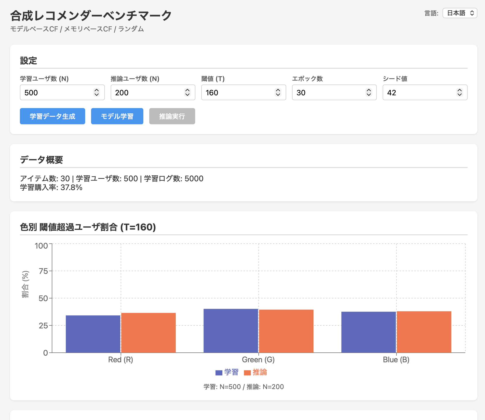

# Synthetic Recommender Benchmark with LLM Assistant

購買行動における推薦アルゴリズムの比較ベンチマークと、LLMによるインサイト生成を行うWebアプリケーションです。


**Demo:** [GitHub Pages](https://martake.github.io/recommendation-sample-with-llm/)



## Features

### 推薦アルゴリズム比較

- **3つの推薦方式を比較**
  - Model-based CF (Matrix Factorization + SGD)
  - Memory-based CF (Item-item Cosine Similarity)
  - Random (ベースライン)
- **合成データによるシミュレーション**
  - ユーザRGB属性 × アイテム色属性による購買ルール
  - 外部データ不要、ブラウザ内で完結
- **豊富な可視化**
  - 購入率比較、ヒストグラム、色別内訳
  - 閾値超過ユーザ割合の比較グラフ

### LLM RAGアシスタント

- **WebLLM**によるブラウザ内LLM推論（サーバ不要）
- **RAG (Retrieval Augmented Generation)** で購買ルール・評価指標を理解した解説
- **言語別モデル切替**
  - 日本語: Qwen2.5-1.5B-Instruct
  - English: Llama-3.2-1B-Instruct
- **プロンプトモード**: Good / Bad / Custom

### 多言語対応

- 日本語 / English 切替 (react-i18next)

## Tech Stack

| Category          | Technology                     |
| ----------------- | ------------------------------ |
| Frontend          | React 18 + TypeScript + Vite   |
| Styling           | CSS (Custom)                   |
| Charts            | Recharts                       |
| i18n              | react-i18next                  |
| LLM               | WebLLM (@mlc-ai/web-llm)       |
| RAG Preprocessing | Python + sentence-transformers |
| Testing           | Vitest, pytest, Playwright     |
| CI/CD             | GitHub Actions                 |
| Container         | Docker + docker-compose        |
| Deployment        | GitHub Pages                   |

## Architecture

```
┌─────────────────────────────────────────────────────────┐
│                    Browser (Client)                      │
├─────────────────────────────────────────────────────────┤
│  React App                                               │
│  ├── Data Generation (items, users, logs)               │
│  ├── Model Training (MF with SGD)                       │
│  ├── Inference Engine (3 methods)                       │
│  ├── Visualization (Recharts)                           │
│  └── LLM Assistant                                       │
│       ├── RAG Retriever (cosine similarity)             │
│       ├── Prompt Builder                                 │
│       └── WebLLM (Llama / Qwen)                         │
└─────────────────────────────────────────────────────────┘

┌─────────────────────────────────────────────────────────┐
│               Build Time (Python)                        │
├─────────────────────────────────────────────────────────┤
│  RAG Preprocessing                                       │
│  ├── Markdown → Chunks                                  │
│  └── sentence-transformers → Embeddings                 │
└─────────────────────────────────────────────────────────┘
```

## Getting Started

### Prerequisites

- Docker & docker-compose

### Development

```bash
# Clone
git clone https://github.com/martake/recommendation-sample-with-llm.git
cd recommendation-sample-with-llm

# Start dev server
docker compose up

# Open browser
open http://localhost:5173/recommendation-sample-with-llm/
```

### RAG Preprocessing (Optional)

RAGナレッジベースを更新する場合:

```bash
# Edit knowledge base
vim frontend/public/rag/rules.md

# Regenerate embeddings
docker compose --profile tools run --rm rag-preprocess
```

### Production Build

```bash
docker compose run --rm frontend npm run build
# Output: frontend/dist/
```

## Testing

本プロジェクトは3種類のテストを実装しています。詳細は [docs/TEST_STRATEGY.md](docs/TEST_STRATEGY.md) を参照してください。

### TypeScript単体テスト (Vitest)

```bash
# テスト実行
docker compose run --rm frontend npm test

# カバレッジ付き
docker compose run --rm frontend npm run test:coverage

# ウォッチモード（開発時）
docker compose run --rm frontend npm run test:watch
```

### Python単体テスト (pytest)

```bash
# テスト実行
docker compose --profile test run --rm test-python

# または直接
docker compose run --rm rag-preprocess pytest test_preprocess.py -v
```

### E2Eテスト (Playwright)

```bash
# 1. フロントエンドを起動
docker compose up frontend

# 2. 別ターミナルでE2Eテストを実行（ローカル）
cd e2e
npx playwright install
npm install
npm test

# UIモードで実行（デバッグ用）
npm run test:ui
```

### CI/CD

GitHub Actionsで自動テストが実行されます（push/PR時）:

- TypeScript単体テスト
- Python単体テスト
- E2Eテスト
- ビルド検証

## Usage

1. **Generate Train** - 学習データを生成
2. **Train Model** - MFモデルを学習
3. **Run Inference** - 3方式で推論実行
4. **LLM Assistant** - 結果の解説を生成

## Project Structure

```
.
├── frontend/
│   ├── src/
│   │   ├── components/      # React components
│   │   ├── data/            # Data generation
│   │   ├── models/          # MF, Item similarity
│   │   ├── inference/       # Inference engine
│   │   ├── llm/             # WebLLM, RAG retriever
│   │   └── i18n/            # Translations
│   └── public/
│       └── rag/             # RAG knowledge base
├── rag/                     # Python preprocessing
├── docker/                  # Dockerfiles
└── docs/                    # Specifications
```

## License

MIT

## Author

[Your Name](https://github.com/martake)
